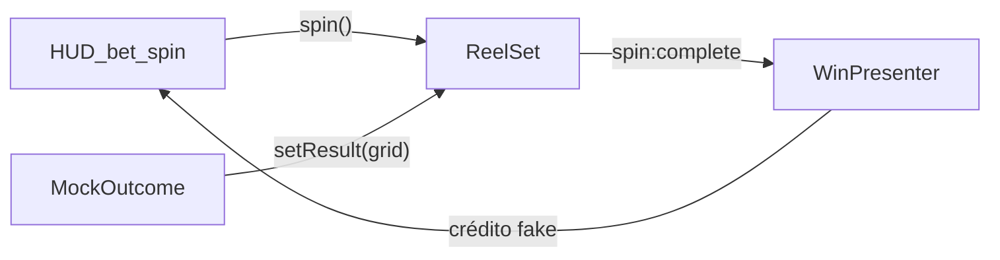

# Orchard Reels

Mini-título **standalone** em OpenFL/Haxe que consome a lib [`haxe-reels`](../..) como um jogo real usaria — stage + HUD + `setResult` + `WinPresenter`.

Não depende de cassino, RGS, wallet, JWT nem de nenhum host externo. O outcome é **mock no client** só para demonstração.

| | |
|---|---|
| Board | 5 reels × 3 células |
| Janela | 960 × 640 |
| Entry | `Source/Main.hx` |
| Engine | classpath `../../src` (haxe-reels) |
| Arte | BitmapData procedural (sem atlas externo) |

---

## O que é / o que não é

**É**

- Exemplo de **consumer** da API pública (`ReelSetBuilder`, `ReelSet`, `WinPresenter`, `FrameClock`, `BitmapReelSymbol`)
- Loop de jogo mínimo: crédito fake → SPIN → mock grid → land → win opcional
- Referência para integrar `haxe-reels` em **qualquer** projeto OpenFL (não só um host específico)

**Não é**

- Lab de tuning do engine (isso fica em [`../../sample/`](../../sample/))
- Paytable / RNG certificável / win math de produção
- Bridge Cocos, debit server-side, catálogo de cassino
- Feature showcase (sem MultiWays, cascade, Hold&Win, Horizontal, Spine nesta v1)



---

## Pré-requisitos

- [Haxe](https://haxe.org/) 4.x
- [OpenFL](https://www.openfl.org/) + Lime (`haxelib install openfl` / `lime`)
- Navegador moderno (target HTML5)

O projeto aponta o source da lib via `project.xml`:

```xml
<source path="Source" />
<source path="../../src" />   <!-- haxe-reels -->
<haxelib name="openfl" />
<haxelib name="lime" />
```

Não precisa `haxelib install haxe-reels` enquanto estiver no monorepo do plugin.

---

## Como rodar

### Dev (recomendado)

```bash
cd haxe-reels/games/orchard-reels
openfl test html5
```

Abre o build HTML5 e sobe um server local do Lime/OpenFL.

### Build + server manual

```bash
cd haxe-reels/games/orchard-reels
openfl build html5
cd Export/html5/bin
python3 -m http.server 8766
# http://127.0.0.1:8766/
```

Saída típica: `Export/html5/bin/OrchardReels.js` + `index.html`.

---

## Controles

| Input | Ação |
|---|---|
| **SPIN** / `Space` | Debita bet do crédito fake, inicia spin, agenda `setResult` mock |
| **SKIP** / `S` | Slam (`skipSpin`) enquanto gira |
| **−** / **+** | Ajusta bet (1–50, step 1); bloqueado durante spin/win |

Status na barra inferior: mensagens de idle, spinning, landing e win.

---

## Loop de jogo (comportamento)

1. **Idle** — crédito / bet / “Welcome — press SPIN”
2. **SPIN** — se `credit >= bet`:
   - `credit -= bet`
   - `reelSet.spin(...)` + `setStopDelays([0,100,200,300,400])`
   - Após ~420 ms: `reelSet.setResult(mockGrid)`
3. **Land** (`spin:complete`):
   - Se o mock marcou mid-line win → `WinPresenter.show([{ cells: midRow }])` e `credit += bet * 10`
   - Senão → volta ao idle
4. Em `spin:start` o presenter/spotlight ativos são abortados/escondidos

### Mock de outcome

~**28%** das rodadas forçam mid-row idêntica em todas as colunas (`7`, `WILD` ou `BAR`).  
Nas demais, a mid-row evita match acidental entre colunas.

> Isso **não** é RNG de jogo. Em produção o grid viria do servidor (`setResult` após debit).

---

## Como usa o haxe-reels

Trecho conceitual (ver `Source/Main.hx`):

```haxe
_reelSet = new ReelSetBuilder()
  .reels(5)
  .visibleCells(3)
  .symbolSize(110, 100)
  .symbolGap(4, 0)
  .bufferSymbols(1)
  .clock(_clock)                    // FrameClock
  .symbols(function(r) {
    for (id in IDS)
      r.registerClass(id, BitmapReelSymbol, { bitmapDataMap: _atlas });
  })
  .weights(["A" => 20, "K" => 20, /* … */, "WILD" => 4])
  .speed("normal", profileWithBounce)
  .initialSpeed("normal")
  .build();

_reelSet.spin(function(_) {});
_reelSet.setResult(grid);           // mock ColumnTarget[]
_winPresenter.show(wins, onDone);   // mid-line highlight
```

Eventos escutados:

| Evento | Uso neste sample |
|---|---|
| `spin:start` | Abort win / hide spotlight |
| `spin:complete` | Avaliar win mock + liberar HUD |

Símbolos: `A`, `K`, `Q`, `J`, `7`, `BAR`, `WILD` — cores fixas em atlas gerado em runtime.

---

## Estrutura do projeto

```
games/orchard-reels/
├── README.md                 ← este arquivo
├── project.xml               ← app OrchardReels, 960×640
├── Source/
│   └── Main.hx               ← jogo inteiro (HUD + loop + arte)
├── templates/html5/template/
│   └── index.html            ← shell mínimo (canvas centrado)
├── assets/                   ← reservado (v1 não usa assets externos)
└── Export/                   ← gerado pelo openfl build (git-ignored em geral)
```

---

## Constantes úteis (`Main.hx`)

| Constante | Default | Significado |
|---|---|---|
| `REELS` / `CELLS` | 5 / 3 | Geometria do board |
| `SYM_W` / `SYM_H` | 110 / 100 | Tamanho da célula |
| `START_CREDIT` | 1000 | Crédito fake inicial |
| `BET_MIN` / `BET_MAX` | 1 / 50 | Limites de aposta |
| Bounce | 48 px | Overshoot no land |
| Win payout | `bet * 10` | Só demo visual |

Para experimentar curva, MultiWays, cascade, etc., use o **sample lab** — não este título.

---

## Estender para um título real

Checklist típico ao copiar este consumer para outro projeto:

1. Trocar classpath `../../src` por `<haxelib name="haxe-reels" />` (ou path do seu monorepo)
2. Substituir `mockOutcome()` por chamada ao seu backend / RGS → `setResult(grid)`
3. Mover win detection para o consumer (paylines / ways) — o engine **só anima**
4. Trocar atlas procedural por sprites/Spine reais (`BitmapReelSymbol` / `SpineReelSymbol`)
5. Separar HUD (UI framework do host) do stage dos reels se precisar

**Invariantes do engine:** nunca confiar no client para dinheiro; debit antes da engine; `setResult` traz o outcome.

---

## Relação com o resto do repo

| Pasta | Papel |
|---|---|
| [`../../src/`](../../src/) | Lib `haxe-reels` |
| [`../../sample/`](../../sample/) | Lab interativo (toggles de API, debug) |
| [`games/orchard-reels/`](.) | Este mini-jogo consumer |

Orchard Reels **não** é publicado sob nenhum path de cassino; rode sempre via OpenFL local.

---

## Troubleshooting

| Sintoma | O que checar |
|---|---|
| Build não acha `reels.*` | `project.xml` tem `<source path="../../src" />`? |
| Canvas preto / vazio | Console do browser; `OrchardReels.js` carregou? |
| SPIN sem efeito | Crédito &lt; bet? Já em `_spinning` / `_busy`? |
| Win nunca aparece | Probabilidade ~28%; force temporariamente `forceWin = true` em `mockOutcome` |

---

## Licença

Segue a do pacote `haxe-reels` (MIT) — ver [`../../haxelib.json`](../../haxelib.json) e NOTICE do repositório.
